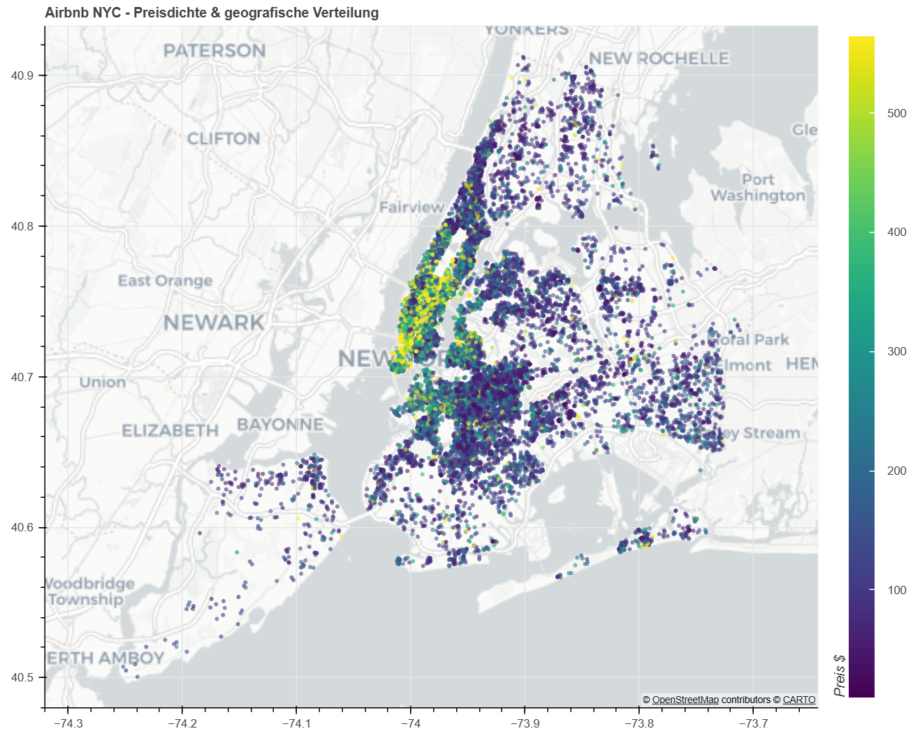

1. **Airbnb Preisanalyse NCY und mehr ...**

    Kurzbeschreibung: Eine explorative Datenanalyse und Regressionsmodellierung von Airbnb-Daten, um Preistreiber in den USA und speziell in New York City zu identifizieren. Auch die Aufbereitung der Rohdaten für die Datenbank PostgreSQL und Visualisierungen mit den verschiedenen Bibliotheken von Plotly über Altair bis Bokeh sind Teil des Projekts.

2. **Projektstruktur**

├── data/           # Rohdaten ausgeblendet, bereinigte Datensätze   
├── notebooks/       # Jupyter Notebooks (Analyse & Modellierung)  
├── models/         # Gespeicherte ML-Modelle  
├── references/     # Literatur und Quellen         
├── reports/        # Präsentationen und Ergebnisberichte   
├── SQL/             # SQL-Skripte zur Datenbankerstellung und -befüllung   
├── src/        # Modularisierter Python-Code (Karten, Model-Funktionen)   
└── README.md

3. **Installation & Setup**

Bibliotheken: pandas, numpy, plotly, bokeh, scikit-learn, sqlalchemy, psycopg2, etc.

    Hinweis: "Erstelle ein Virtual Environment und installiere die Requirements."

4. **Key Features / Analyse-Highlights**

    Interaktive Karten: USA-Übersicht mit Plotly und Preisdichte in NYC mit Bokeh.

    Datenbereinigung und -aufbereitung: Umgang mit Outliern und fehlenden Werten, ln-Transformation der Preisvariable und Feature-Engineering (z.B. 'distance to center')

    Regression: Vorhersage von Preisen basierend auf Merkmalen wie Zimmeranzahl und 'distance to center' (Times Square), Identifikation von Preistreibern

5. **Wichtigste Erkenntnisse (Insights) und Ausblick**

Der Stadtteil Manhanttan ist der größte Preistreiber und der Zimmertyp 'shared_room' der negativste Einflussfaktor auf den Preis. Nächste Schritt sind die Erstellung von Pipelines zur Automatisierung der Datenaufbereitung und Modellierung, um die linearen Modelle OLS, Lasso und Ridge weiter auszubauen, mehr Featues einzubeziehen und auf andere US-amerikanische Städte anzuwenden.

